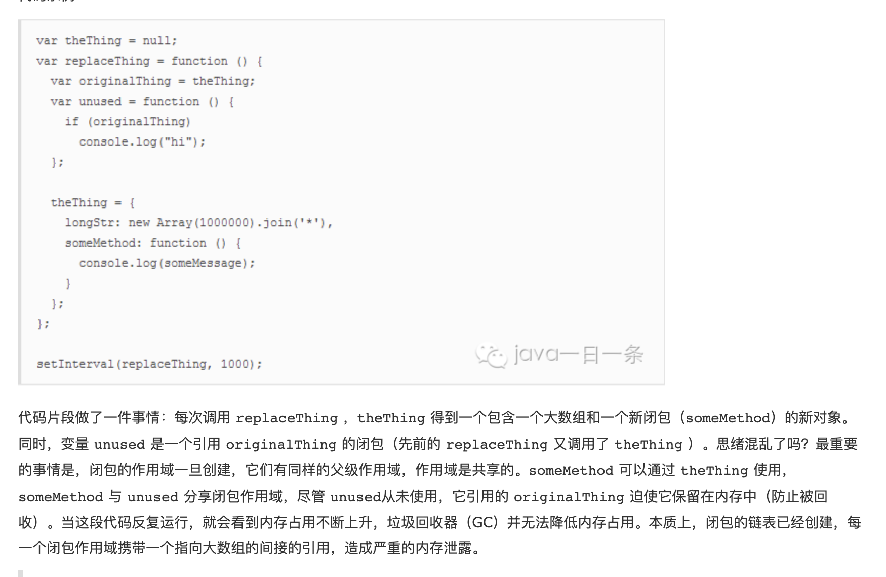

# Interview-review
## 面试复盘记录
### 8/17 运匠信息
#### 深拷贝方法（非json.stringify()和json.parse()）
三点考虑
1. 基本类型直接复制
2. 复杂类型判断并选择下层递归直至找到基本类型
3. 循环引用在判断是复杂类型的情况下 复制至copy_obj中 若子属性和本身相等 则直接复制循环引用
```
// 解决循环引用问题
var a = {};
a.info = a;
function deepCopy(target){
    let copyed_objs = [];//此数组解决了循环引用和相同引用的问题，它存放已经递归到的目标对象
    function _deepCopy(target){
        if((typeof target !== 'object')||!target){return target;}
        for(let i= 0 ;i < copyed_objs.length;i++){
            if(copyed_objs[i].target === target){
                return copyed_objs[i].copyTarget;
            }
        }
        let obj = {};
        if(Array.isArray(target)){
            console.log('target4', target)
            obj = [];//处理target是数组的情况
        }
        copyed_objs.push({target:target,copyTarget:obj})
        Object.keys(target).forEach(key=>{
            if(obj[key]){ return;}
            obj[key] = _deepCopy(target[key]);
        });
        return obj;
    }
    return _deepCopy(target);
}
console.log(deepCopy(a));
```
----
#### http响应状态码的含义：
可参 https://www.runoob.com/http/http-status-codes.html
+ 200 ：请求成功。一般用于GET与POST请求
+ 302 ：临时移动。与301类似。但资源只是临时被移动。客户端应继续使用原有URI
+ 401 ：请求要求用户的身份认证
+ 500 ：服务器内部错误，无法完成请求
----
#### http响应状态码的含义：
Cookie,localStorage,sessionStorage的区别
##### Cookie
cookie数据不能超过4k, cookie数据始终在同源的http请求中携带（即使不需要），即 cookie在浏览器和服务器间来回传递。
##### localStorage
localStorage约20M, 只能存储字符串 可以将对象JSON.stringify() 编码后存储
##### sessionStorage
sessionStorage约5M, 它只是可以将一部分数据在当前会话中保存下来，刷新页面数据依旧存在。但当页面关闭后，sessionStorage 中的数据就会被清空。
sessionStorage不能在不同的浏览器窗口中共享，即使是同一个页面；localStorage 在所有同源窗口中都是共享的；cookie也是在所有同源窗口中都是共享的。

----
#### eventBus(不常用，后续更新)

----
----
----
### 8/18 上海博卡
#### C端屏幕适配（使用rem）
以iPhone6为例子（375，667）
>适配文档分享：链接: https://pan.baidu.com/s/1Q7uALfCOLVAb50YkVjfpWQ  密码: 7akb
```
let getSize = document.documentElement.clientWidth / 10 = 37.5
/* 设置font-size */
document.style.fontSize = `${getSize}px`;
/* 由此，1rem = 37.5px;
1px = 2/75rem
@rem: 2/75rem;
接下来就可以使用@rem了
```
----
#### iphoneX适配
    padding-top: constant(safe-area-inset-top);

    padding-top: env(safe-area-inset-top);
    
    padding-bottom: constant(safe-area-inset-bottom);
    
    padding-bottom: env(safe-area-inset-bottom);
----
#### 客户端及webview之间通信
就是在js上下文注入一个JavascriptInterface。
假设这个JavascriptInterface名为AndroidIn。
那么在webview里面可以直接调用Android

    // webview
    WebView webView = (WebView)findViewById(R.id.shop);
    webView.getSettings().setJavaScriptEnabled(true);
     class JsInterface {
        @JavascriptInterface
        public void showToast(String toast) {
            Toast.makeText(MainActivity.this, toast, Toast.LENGTH_SHORT).show();
        }
    }
    webView.addJavascriptInterface(new JsInterface(), "AndroidIn");

    // 直接调用android提供的方法
    <div>我是webview</div>
    <div id="cs">测试JavascriptInterface</div>
    </body>
    <script>
        let i = 0;
        $("#cs").on("click", function(){
            AndroidIn.showToast("我是弹窗");
        })
    </script>
----
#### Vue虚拟DOM概念
所有的浏览器渲染引擎工作流程大致分为5步：创建DOM 树 —> 创建 Style Rules -> 构建 Render 树 —> 布局 Layout -—> 绘制 Painting。

- 第一步，构建 DOM 树：用 HTML 分析器，分析 HTML 元素，构建一棵 DOM 树；
- 第二步，生成样式表：用 CSS 分析器，分析 CSS 文件和元素上的 inline 样式，生成页面的样式表；
- 第三步，构建 Render 树：将 DOM 树和样式表关联起来，构建一棵 Render 树（Attachment）。每个 DOM 节点都有 attach 方法，接受样式信息，返回一个 render 对象（又名 renderer），这些 render 对象最终会被构建成一棵 Render 树；
- 第四步，确定节点坐标：根据 Render 树结构，为每个 Render 树上的节点确定一个在显示屏上出现的精确坐标；
- 第五步，绘制页面：根据 Render 树和节点显示坐标，然后调用每个节点的 paint 方法，将它们绘制出来。

如果有update就进行更新的话，太消耗资源，也容易产生卡顿。

JS 操作真实 DOM 的代价？ 
用我们传统的开发模式，原生 JS 或 JQ 操作 DOM 时，浏览器会从构建 DOM 树开始从头到尾执行一遍流程。在一次操作中，我需要更新 10 个 DOM 节点，浏览器收到第一个 DOM 请求后并不知道还有 9 次更新操作，因此会马上执行流程，最终执行10 次。例如，第一次计算完，紧接着下一个 DOM 更新请求，这个节点的坐标值就变了，前一次计算为无用功。计算 DOM 节点坐标值等都是白白浪费的性能。即使计算机硬件一直在迭代更新，操作 DOM 的代价仍旧是昂贵的，频繁操作还是会出现页面卡顿，影响用户体验
                 
虚拟 DOM 就是为了解决浏览器性能问题而被设计出来的。若一次操作中有 10 次更新 DOM 的动作，虚拟 DOM 不会立即操作 DOM，而是将这 10 次更新的 diff 内容保存到本地一个 JS 对象中，最终将这个 JS 对象一次性 attch 到 DOM 树上，再进行后续操作，避免大量无谓的计算量。所以，用 JS 对象模拟 DOM 节点的好处是，页面的更新可以先全部反映在 JS 对象(虚拟 DOM )上，操作内存中的 JS 对象的速度显然要更快，等更新完成后，再将最终的 JS 对象映射成真实的 DOM，交由浏览器去绘制。

----
#### el-input实现原理
el-input为组件v-modal默认绑定在自组件的value上，

当传入value值时，绑定在自组件的input上，再通过样式及其他参数对el-input进行更改

    <template>
        <div>
            <input v-model="bindInputValue"></input>
            // 或者使用
            <input v-bind="$attrs" @input="handleInput"></input>
        </div>
    </template>
    <script>
    export default {
        name: "commonInput",
        props: {
            value: {
                type: String,
                default: ''
            }
        },
        computed: {
            bindInputValue: {
                get() {
                    return this.value;
                },
                set(val) {
                    this.handleInput(val)
                }
            }
        },
        methods: {
            handleInput(val) {
                this.$emit('input', val)
            }
        }
    };
    </script>
----
#### websocket实现实时交互
    template>
      <div class="test">
    
      </div>
    </template>
    
    <script>
      export default {
        name : 'test',
        data() {
          return {
            websock: null,
          }
        },
        created() {
          this.initWebSocket();
        },
        destroyed() {
          this.websock.close() //离开路由之后断开websocket连接
        },
        methods: {
          initWebSocket(){ //初始化weosocket
            const wsuri = "ws://127.0.0.1:8080";
            this.websock = new WebSocket(wsuri);
            this.websock.onmessage = this.websocketonmessage;
            this.websock.onopen = this.websocketonopen;
            this.websock.onerror = this.websocketonerror;
            this.websock.onclose = this.websocketclose;
          },
          websocketonopen(){ //连接建立之后执行send方法发送数据
            let actions = {"test":"12345"};
            this.websocketsend(JSON.stringify(actions));
          },
          websocketonerror(){//连接建立失败重连
            this.initWebSocket();
          },
          websocketonmessage(e){ //数据接收
            const redata = JSON.parse(e.data);
          },
          websocketsend(Data){//数据发送
            this.websock.send(Data);
          },
          websocketclose(e){  //关闭
            console.log('断开连接',e);
          },
        },
      }
    </script>
    <style lang='less'>
     
    </style>
----
#### js闭包引起内存泄漏
